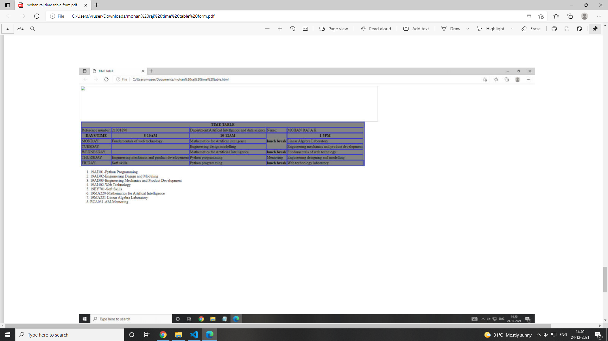

# Experiment_Time_table
## AIM
To Write a html webpage page to display your timetable.

# ALGORITHM
### STEP 1
create a simple table using table tag
### STEP 2
Add header row using th tag
### STEP 3
Add your timetable
### STEP 4
Execute the program

# CODE
<html>

   <head>
      <title>TIME TABLE</title>
   </head>
	
   <body>
      <table border = "1" cellspacing="1" bordercolor="blue" bgcolor="grey">
         <tr>
            <th colspan="8">TIME TABLE</th>
         </tr>
         <tr>
          <td>Reference number:</td>
          <td>21001890</td>
          <td>Department:Artifical Intellgence and Machine learning</td>
          <td>Name:</td>
          
         <td>mohan raj A K
         </tr>
         
         <tr>
            <th>DAYS/TIME</th>
            <th>8-10AM</th>
            <th>10-12AM</th>
            <th rowspan="3">lunch break</th>
             <th>1-3PM</th>
         </tr>
          <tr>
            <td>MONDAY</td>
             <td>Fundamentals of web technology</td>
             <td>Mathematics for Artifical intellgence</td>
             <td>Linear Algebra Laboratory</td>
         </tr>
         <tr>
           <td>TUESDAY</td>
<td></td>
           <td>Engineering design modelling</td>
             <td>Engineering mechanics and product development</td>
           
         </tr>
         <tr>
           <td>WEDNESDAY</td>
           <td></td>
           <td>Mathematics for Artificial Intelligence</td>
<th>lunch break</th>
             <td>Fundamentals of web technlogy</td>
             
         </tr>
         <tr>
           <td>THURSDAY</td>
           <td>Engineering mechanics and product developement</td>
             <td>Python programming</td>
             <td>Mentoring</td>
             <td>Engineering designing and modelling</td>
             
         </tr>
         <tr>
           <td>FRIDAY</td>
           <td>Soft skills</td>
             <td>Python programming</td>
<th>lunch break</th>
             <td>Web technology laboratory</td>
             <td></td>
         </tr>
    
      </table>
<ol type="1.">
<li>19AI301-Python Programming</li>
<li>19AI302-Enginnering Degign and Modeling</li>
<li>19AI303-Engineering Mechanics and Product Development</li>
<li>19AI402-Web Technology</li>
<li>19EY701-Soft Skills</li>
<li>19MA220-Mathematics for Artifical Intelligence</li>
<li>19MA221-Linear Algebra Laboratory</li>
<li>ECA051-AM-Mentoring</li>

      
   </body>
</html>

# OUPUT

### RESULT:
Thus, a html webpage is created to display the timetable.